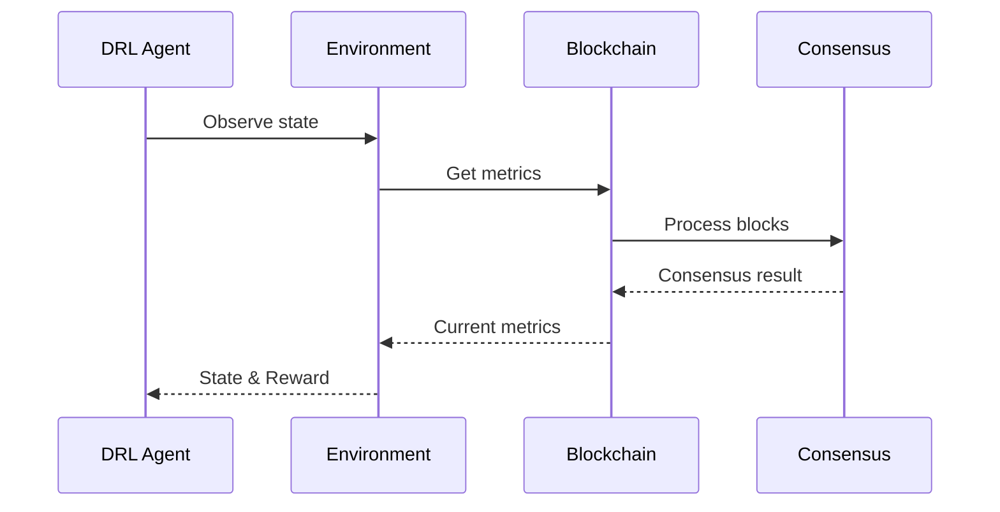

# Chi tiết Kỹ thuật Các Module DQNSB

## 1. Module Blockchain (`src/blockchain/`)

### 1.1 Block (`block.py`)

```python
class Transaction:
    def __init__(self, sender: str, receiver: str, amount: float):
        self.sender = sender
        self.receiver = receiver
        self.amount = amount
        self.timestamp = time.time()
```

- **Mục đích**: Quản lý cấu trúc giao dịch và block
- **Chức năng chính**:
  - Tạo và xác thực giao dịch
  - Tính hash cho block và transaction
  - Quản lý block size và interval
- **Tham số quan trọng**:
  - `max_transactions`: Giới hạn số transaction/block
  - `block_interval`: Thời gian giữa các block

### 1.2 Shard (`shard.py`)

```python
class Shard:
    def __init__(self, shard_id: int, num_nodes: int):
        self.shard_id = shard_id
        self.chain = []  # Local blockchain
        self.consensus = PBFT(num_nodes)
```

- **Mục đích**: Quản lý các shard độc lập
- **Chức năng chính**:
  - Xử lý transaction trong shard
  - Tạo và xác thực block
  - Đồng bộ trạng thái với các shard khác
- **Cơ chế quan trọng**:
  - Dynamic resharding
  - Load balancing
  - Cross-shard communication

### 1.3 Directory Committee (`directory_committee.py`)

```python
class DirectoryCommittee:
    def __init__(self, num_shards: int, nodes_per_shard: int):
        self.shards = []
        self.final_chain = []
```

- **Mục đích**: Điều phối các shard
- **Chức năng chính**:
  - Quản lý danh sách shard
  - Phân phối transaction
  - Tạo final block từ các shard
- **Cơ chế quan trọng**:
  - Transaction routing
  - Shard coordination
  - State finalization

## 2. Module DRL (`src/drl/`)

### 2.1 Agent (`agent.py`)

```python
class DQN(nn.Module):
    def __init__(self, state_size: int, action_size: int):
        self.features = nn.Sequential(
            nn.Linear(state_size, 1024),
            nn.ReLU(),
            nn.Linear(1024, 512)
        )
```

- **Mục đích**: Triển khai DRL agent
- **Kiến trúc mạng**:
  - Input layer: State space
  - Hidden layers: 1024 -> 512 -> 256 neurons
  - Output layer: Action space
- **Cơ chế học**:
  - Experience replay
  - Double DQN
  - Dueling architecture
- **Hyperparameters**:
  - Learning rate: 0.0003
  - Batch size: 256
  - Memory size: 100000
  - Gamma: 0.99

### 2.2 Environment (`environment.py`)

```python
class BlockchainEnvironment:
    def __init__(self):
        self.observation_space = spaces.Box(
            low=np.array([2, 4, 0, 0]),
            high=np.array([8, 16, 100, 1])
        )
```

- **Mục đích**: Mô phỏng môi trường blockchain
- **State space**:
  - Số lượng shard
  - Nodes per shard
  - TPS hiện tại
  - Security score
- **Action space**:
  - Tăng/giảm số shard
  - Tăng/giảm nodes per shard
- **Reward function**:
  - Base reward từ TPS và security
  - Bonus cho cải thiện
  - Penalty cho suy giảm

## 3. Module Consensus (`src/consensus/`)

### 3.1 PBFT (`pbft.py`)

```python
class PBFT:
    def reach_consensus(self, block):
        if not self._pre_prepare_phase(block):
            return False
        prepare_votes = self._prepare_phase()
        return self._commit_phase()
```

- **Mục đích**: Triển khai PBFT consensus
- **Các phase**:
  1. Pre-prepare
  2. Prepare
  3. Commit
- **Fault tolerance**:
  - Chịu được f = (n-1)/3 node lỗi
  - n: tổng số node
- **View change**:
  - Xử lý khi primary node fail
  - Bầu primary node mới

## 4. Module Simulation (`src/simulation/`)

### 4.1 Network (`network.py`)

```python
class NetworkSimulator:
    def __init__(self, num_shards: int, nodes_per_shard: int):
        self.dc = DirectoryCommittee(num_shards, nodes_per_shard)
        self.scenarios = {
            'normal': {'malicious_ratio': 0.1},
            'high_malicious': {'malicious_ratio': 0.2}
        }
```

- **Mục đích**: Mô phỏng mạng blockchain
- **Các kịch bản**:
  - Normal operation
  - High malicious nodes
  - Large transactions
  - Worst case
- **Metrics**:
  - TPS
  - Latency
  - Security score
  - Resource usage

## 5. Module Visualization (`src/visualization/`)

### 5.1 Plots (`plots.py`)

```python
class BlockchainVisualizer:
    def plot_training_metrics(self, metrics):
        plt.figure(figsize=(15, 10))
        plt.subplot(2,2,1)
        plt.plot(metrics['tps'])
```

- **Mục đích**: Trực quan hóa metrics
- **Các biểu đồ**:
  - Training progress
  - Performance comparison
  - Security analysis
  - Resource utilization
- **Output formats**:
  - PNG images
  - Interactive plots
  - Real-time monitoring

## 6. Configuration (`src/config.py`)

```python
class Config:
    # Network Configuration
    INITIAL_SHARDS = 4
    MAX_SHARDS = 8
    NODES_PER_SHARD = 12

    # DRL Configuration
    BATCH_SIZE = 256
    LEARNING_RATE = 0.0003
```

- **Mục đích**: Quản lý cấu hình hệ thống
- **Các nhóm cấu hình**:
  - Network parameters
  - DRL hyperparameters
  - Blockchain settings
  - Simulation configs
- **Dynamic configs**:
  - Auto-tuning parameters
  - Environment-specific settings

## 7. Tương tác giữa các Module

### 7.1 Flow Diagram



### 7.2 Data Flow

- **Transaction Processing**:

  1. Client gửi transaction
  2. Directory Committee route đến shard
  3. Shard xử lý và đạt consensus
  4. Update final chain

- **Optimization Loop**:
  1. Environment thu thập metrics
  2. DRL Agent đưa ra action
  3. Blockchain thực thi thay đổi
  4. Đánh giá và reward

## 8. Deployment Guide

### 8.1 Requirements

- Python 3.8+
- CUDA 11.0+ (cho GPU)
- 16GB RAM
- 100GB SSD

### 8.2 Installation

```bash
# Clone repository
git clone https://github.com/fuondai/DQNSB-Blockchain.git

# Install dependencies
pip install -r requirements.txt

# Run tests [COMING SOON ⚠️]
python -m pytest tests/
```

### 8.3 Configuration

```python
# config.py
INITIAL_SHARDS = 4
MAX_SHARDS = 8
NODES_PER_SHARD = 12
```

### 8.4 Monitoring

- Prometheus metrics
- Grafana dashboards
- Log aggregation

## 9. Testing [COMING SOON ⚠️]

### 9.1 Unit Tests

```python
def test_block_creation():
    block = Block(shard_id=0, previous_hash="0")
    assert block.transactions == []
```

### 9.2 Integration Tests

```python
def test_cross_shard_tx():
    dc = DirectoryCommittee(4, 10)
    tx = Transaction("A", "B", 100)
    assert dc.process_transaction(tx)
```

### 9.3 Performance Tests

```python
def benchmark_tps():
    simulator = NetworkSimulator(4, 10)
    return simulator.measure_tps(1000)
```

## 10. Troubleshooting

### 10.1 Common Issues

1. Low TPS

   - Check network latency
   - Verify shard distribution
   - Monitor resource usage

2. Security Alerts
   - Check malicious node detection
   - Verify consensus logs
   - Review cross-shard transactions

### 10.2 Performance Tuning

1. Network Optimization

   - Adjust block size
   - Tune consensus parameters
   - Optimize cross-shard communication

2. DRL Tuning
   - Adjust learning rate
   - Modify reward function
   - Fine-tune network architecture

## 11. References

- [DQN Paper](https://ieeexplore.ieee.org/document/9133069)
- [Ethereum Sharding](https://github.com/ethereum/sharding/tree/master)
