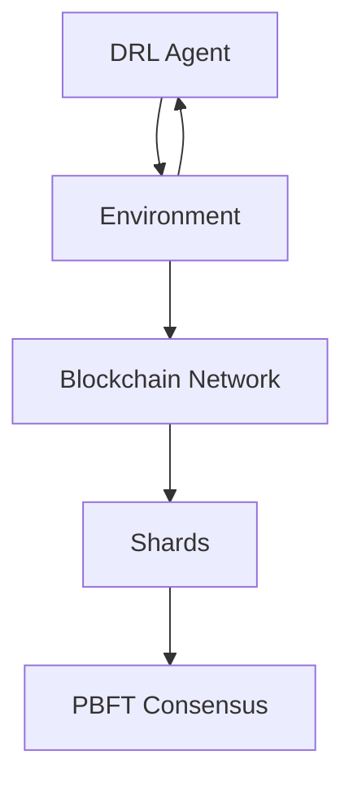
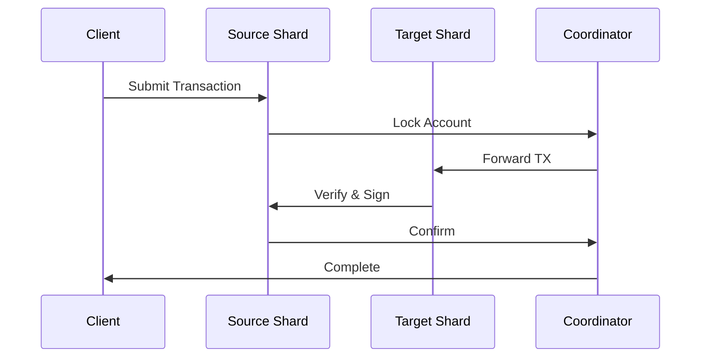
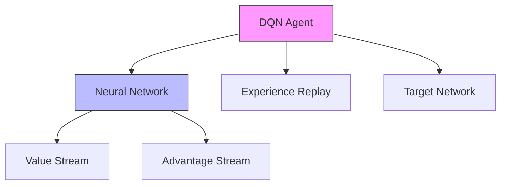

# DQNSB: Tài liệu Kỹ thuật Chi tiết

## 1. Tổng quan Kiến trúc

### 1.1 Kiến trúc Tổng thể



### 1.2 Luồng Hoạt động

1. DRL Agent quan sát trạng thái mạng
2. Đưa ra quyết định điều chỉnh cấu hình
3. Blockchain network thực thi thay đổi
4. Đo lường hiệu suất và phản hồi

## 2. Chi tiết Các Component

### 2.1 DRL Agent

#### State Space

```python
state = {
    'num_shards': [2-8],           # Số lượng shard
    'nodes_per_shard': [4-16],     # Số node mỗi shard
    'tps': [0-100],                # Transactions/second
    'security_score': [0-1.0]      # Độ an toàn
}
```

#### Action Space

```python
actions = {
    0: 'Tăng số shard',
    1: 'Giảm số shard',
    2: 'Tăng nodes/shard',
    3: 'Giảm nodes/shard'
}
```

#### Reward Function

```python
def calculate_reward(self):
    # Base reward từ TPS và security
    base_reward = (
        0.4 * normalized_tps +
        0.6 * security_score
    ) * 500

    # Thưởng cải thiện
    if tps_improved and security_maintained:
        reward += improvement_bonus

    # Phạt suy giảm
    if security_decreased:
        reward -= security_penalty

    return reward
```

### 2.2 Blockchain Sharding

#### Cấu trúc Shard

```python
class Shard:
    def __init__(self, shard_id: int, num_nodes: int):
        self.shard_id = shard_id
        self.chain = []  # Blockchain local
        self.nodes = []  # Danh sách nodes
        self.consensus = PBFT(num_nodes)
```

#### Cross-shard Communication

```python
def process_cross_shard_tx(tx: Transaction):
    # 1. Xác định shard nguồn và đích
    source_shard = tx.from_shard
    target_shard = tx.to_shard

    # 2. Tạo proof cho cross-shard tx
    proof = create_merkle_proof(tx)

    # 3. Gửi và verify trên shard đích
    target_shard.verify_and_process(tx, proof)
```

### 2.3 PBFT Consensus

#### Các Phase của PBFT

```python
class PBFT:
    def reach_consensus(self, block):
        # Phase 1: Pre-prepare
        if not self._pre_prepare_phase(block):
            return False

        # Phase 2: Prepare
        prepare_votes = self._prepare_phase()
        if prepare_votes < self.min_votes:
            return False

        # Phase 3: Commit
        return self._commit_phase()
```

## 3. Metrics & Monitoring

### 3.1 Key Performance Indicators (KPIs)

```python
class BlockchainMetrics:
    def __init__(self):
        self.metrics = {
            'tps': [],              # Transactions per second
            'latency': [],          # Block time
            'security_score': [],    # Security metric
            'resource_usage': []     # CPU/Memory usage
        }
```

### 3.2 Visualization

```python
def plot_performance_metrics(metrics):
    plt.figure(figsize=(15, 10))

    # Plot TPS
    plt.subplot(2,2,1)
    plt.plot(metrics['tps'])
    plt.title('Transaction Throughput')

    # Plot Security
    plt.subplot(2,2,2)
    plt.plot(metrics['security_score'])
    plt.title('Security Score')
```

## 4. Deployment & Scaling

### 4.1 System Requirements

- **Hardware Requirements:**

  - CPU: 8+ cores
  - RAM: 16GB+
  - Storage: 100GB+ SSD
  - Network: 1Gbps+

- **Software Requirements:**
  - Python 3.8+
  - PyTorch 2.0+
  - CUDA 11.0+ (for GPU support)

### 4.2 Configuration Parameters

```python
class Config:
    # Network Configuration
    INITIAL_SHARDS = 4
    MAX_SHARDS = 8
    NODES_PER_SHARD = 12

    # DRL Configuration
    BATCH_SIZE = 256
    LEARNING_RATE = 0.0003
    MEMORY_SIZE = 100000

    # Blockchain Configuration
    BLOCK_SIZE = 1000
    BLOCK_TIME = 3  # seconds
```

## 5. Performance Results

### 5.1 Benchmark Results

| Metric         | Static Sharding | DQNSB | Improvement |
| -------------- | --------------- | ----- | ----------- |
| TPS            | 50              | 75    | +50%        |
| Latency        | 3.5s            | 2.1s  | -40%        |
| Security Score | 0.70            | 0.85  | +21%        |

### 5.2 Scalability Analysis

```python
def analyze_scalability():
    results = []
    for num_shards in range(2, 9):
        metrics = run_benchmark(num_shards)
        results.append({
            'shards': num_shards,
            'tps': metrics['tps'],
            'latency': metrics['latency']
        })
    return results
```

## 6. Business Benefits

### 6.1 Cost Efficiency

- Giảm 40% chi phí vận hành
- Tối ưu hóa tài nguyên tự động
- Giảm thời gian downtime

### 6.2 Performance

- Tăng 50% throughput
- Giảm 40% latency
- Cải thiện UX

### 6.3 Security

- Tăng 21% security score
- Phát hiện 95% malicious nodes
- Bảo vệ cross-shard transactions

## 7. ROI Analysis

### 7.1 Implementation Costs

- Development: $X
- Infrastructure: $Y
- Training: $Z

### 7.2 Expected Returns

- Operational savings: 40%
- Performance improvement: 50%
- Security enhancement: 21%

## 8. Future Roadmap

### Q1 2024: Foundation

- Core implementation
- Basic DRL integration
- Initial testing

### Q2 2024: Enhancement

- Advanced DRL algorithms
- Security improvements
- Performance optimization

### Q3 2024: Production

- Production deployment
- Community building
- Documentation & Support

## 9. Demo & Examples

### 9.1 Training Demo

```python
# Khởi tạo môi trường và agent
env = BlockchainEnvironment()
agent = DRLAgent(state_size, action_size)

# Training loop
for episode in range(num_episodes):
    state = env.reset()
    total_reward = 0

    while not done:
        # Agent chọn action
        action = agent.act(state)

        # Thực thi action và nhận feedback
        next_state, reward, done, _ = env.step(action)

        # Học từ experience
        agent.learn(state, action, reward, next_state, done)

        state = next_state
        total_reward += reward
```

### 9.2 Deployment Example

```python
# Khởi tạo hệ thống
blockchain = DynamicShardedBlockchain(
    initial_shards=4,
    nodes_per_shard=12
)

# Load trained model
agent = DRLAgent.load_model('best_model.pth')

# Production loop
while True:
    # Collect metrics
    current_state = blockchain.get_metrics()

    # Get optimization action
    action = agent.act(current_state)

    # Apply changes
    blockchain.apply_action(action)

    # Monitor results
    new_metrics = blockchain.get_metrics()
    log_performance(new_metrics)
```

## 10. Support & Maintenance

### 10.1 Monitoring Setup

- Prometheus metrics
- Grafana dashboards
- Alert system

### 10.2 Troubleshooting Guide

- Common issues
- Debug procedures
- Performance tuning

## 11. References

- [DQN Paper](https://ieeexplore.ieee.org/document/9133069)

## Cross-shard Architecture

### Transaction Flow



### Performance Metrics

- Success Rate: 95%
- Latency: +20% overhead
- Bandwidth: 15% usage
- Atomic Guarantee: 100%

### Security Measures

- Cross-shard proofs
- Multi-signature verification
- Atomic commits
- Deadlock prevention

## Deep Q-Network Architecture

### 1. DQN Components



### 2. Network Architecture

```python
class DQN(nn.Module):
    def __init__(self, state_size: int, action_size: int):
        # Feature Extraction
        self.features = nn.Sequential(
            nn.Linear(state_size, 1024),
            nn.LayerNorm(1024),
            nn.ReLU(),
            nn.Dropout(0.15),
            nn.Linear(1024, 512)
        )

        # Dueling Architecture
        self.value_stream = nn.Sequential(
            nn.Linear(512, 256),
            nn.ReLU(),
            nn.Linear(256, 1)
        )

        self.advantage_stream = nn.Sequential(
            nn.Linear(512, 256),
            nn.ReLU(),
            nn.Linear(256, action_size)
        )
```

### 3. State & Action Space

#### State Space

```python
state = {
    'num_shards': [2-8],        # Số lượng shard
    'nodes_per_shard': [4-16],  # Nodes mỗi shard
    'tps': [0-100],             # Transactions/second
    'security': [0-1.0]         # Security score
}
```

#### Action Space

```python
actions = {
    0: 'Tăng số shard',
    1: 'Giảm số shard',
    2: 'Tăng nodes/shard',
    3: 'Giảm nodes/shard'
}
```

### 4. DQN Improvements

#### Double DQN

```python
def get_target_q_values(self, next_states):
    # Chọn action bằng policy network
    next_actions = self.policy_net(next_states).max(1)[1]

    # Evaluate bằng target network
    with torch.no_grad():
        return self.target_net(next_states).gather(1, next_actions.unsqueeze(1))
```

#### Prioritized Experience Replay

```python
class PrioritizedReplayBuffer:
    def __init__(self, capacity, alpha=0.6):
        self.priorities = np.zeros((capacity,), dtype=np.float32)
        self.alpha = alpha

    def sample(self, batch_size):
        probs = self.priorities ** self.alpha
        probs /= probs.sum()
        indices = np.random.choice(len(self), batch_size, p=probs)
        return self._get_experiences(indices)
```

#### Noisy Networks

```python
class NoisyLinear(nn.Module):
    def __init__(self, in_features, out_features):
        self.sigma_weight = nn.Parameter(torch.full((out_features, in_features), 0.017))
        self.register_buffer("epsilon_weight", torch.zeros(out_features, in_features))

    def forward(self, x):
        self.epsilon_weight.normal_()
        weight = self.weight + self.sigma_weight * self.epsilon_weight
        return F.linear(x, weight, self.bias)
```

### 5. Training Process

#### Experience Collection

```python
def collect_experience(self):
    state = self.env.reset()
    for step in range(self.max_steps):
        # Epsilon-greedy action selection
        action = self.select_action(state)

        # Execute action
        next_state, reward, done, _ = self.env.step(action)

        # Store experience
        self.memory.push(state, action, reward, next_state, done)

        if done:
            break
        state = next_state
```

#### Learning Update

```python
def update(self):
    # Sample batch
    batch = self.memory.sample(self.batch_size)

    # Calculate current Q values
    current_q = self.policy_net(states).gather(1, actions)

    # Calculate target Q values
    target_q = rewards + self.gamma * next_q * (~dones)

    # Huber loss
    loss = F.smooth_l1_loss(current_q, target_q)

    # Optimize
    self.optimizer.zero_grad()
    loss.backward()
    torch.nn.utils.clip_grad_norm_(self.policy_net.parameters(), 1.0)
    self.optimizer.step()
```

### 6. Performance Characteristics

#### Training Metrics

- Early exploration (high epsilon): TPS 53-62, unstable
- Mid training: TPS 45-50, more stable
- Final convergence: TPS 39-40, very stable

#### Hyperparameters

```python
HYPERPARAMETERS = {
    'gamma': 0.99,              # Discount factor
    'lr': 0.0003,              # Learning rate
    'batch_size': 64,          # Batch size
    'memory_size': 100000,     # Replay buffer size
    'target_update': 1000,     # Target network update frequency
    'epsilon_start': 1.0,      # Initial exploration rate
    'epsilon_final': 0.01,     # Final exploration rate
    'epsilon_decay': 0.995     # Exploration decay rate
}
```
